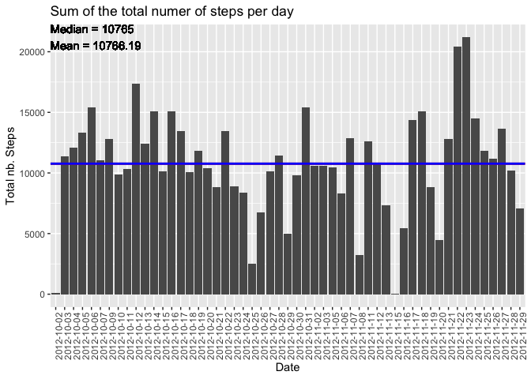
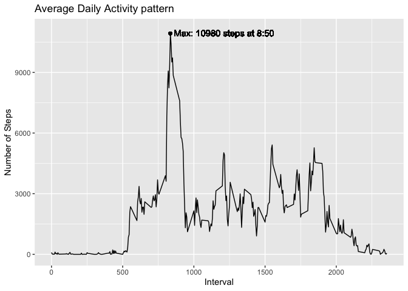
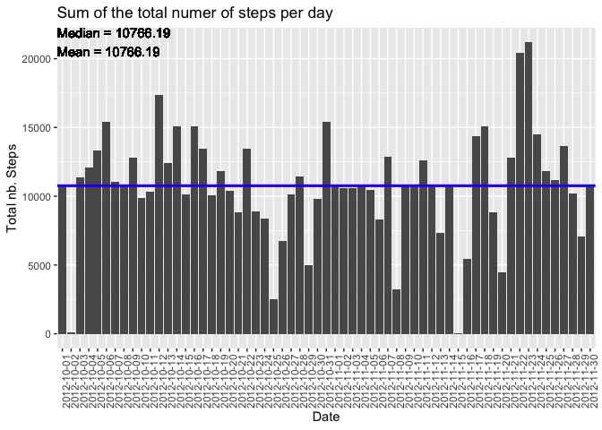
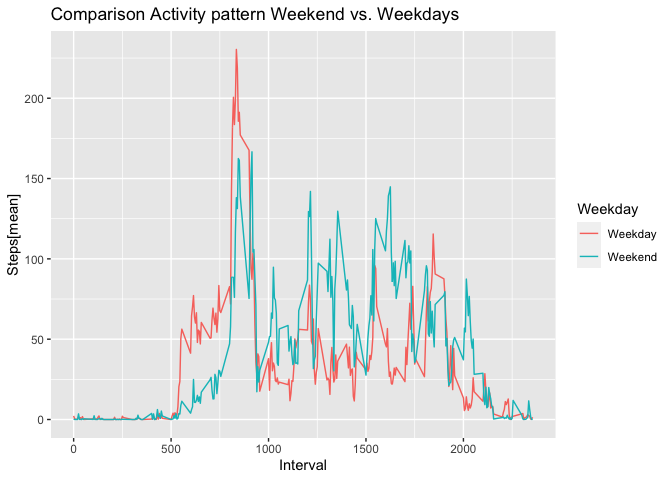

## Loading and preprocessing the data


```r
library(dplyr)
```

```
## 
## Attaching package: 'dplyr'
```

```
## The following objects are masked from 'package:stats':
## 
##     filter, lag
```

```
## The following objects are masked from 'package:base':
## 
##     intersect, setdiff, setequal, union
```

```r
library(ggplot2)

activity<- read.csv("activity.csv", header = TRUE)

activity_full<- activity[complete.cases(activity),]
```
## What is mean total number of steps taken per day?


```r
steps<-  activity_full  %>%

    group_by(date)  %>%
    
    summarise(sum(steps))  

steps<-as.data.frame(steps)

names(steps)<- c("Date", "Total nb. Steps")

ggplot(steps, aes(x=Date, y= `Total nb. Steps`)) + geom_col() + theme(axis.text.x = element_text(angle = 90, hjust = 1)) + ggtitle("Sum of the total numer of steps per day") + geom_hline(yintercept = median(steps$`Total nb. Steps`),col="red", lwd=1) + geom_hline(yintercept = mean(steps$`Total nb. Steps`),col="blue", lwd=1) + geom_text(aes(x=-Inf,y=Inf,hjust=0, vjust=1,label="Median = 10765
Mean = 10766.19"))
```

<!-- -->

- The sum of steps goes from less than 5000 for some days up to more than 20000 steps for others.
- Median = 10765
- Mean = 10766.19


## What is the average daily activity pattern?


```r
steps2<-  activity_full  %>%

    group_by(interval)  %>%
    
    summarise(sum(steps))  

steps2<-as.data.frame(steps2)

names(steps2)<- c("Interval","Number of Steps")

ggplot(steps2, aes(x=Interval, y= `Number of Steps`)) + geom_line() + geom_point(x=835,y=10927) + geom_text(aes(x=860,y=11100,hjust=0, vjust=1,label="Max: 10980 steps at 8:50"))+ ggtitle("Average Daily Activity pattern")
```

<!-- -->

- Clear peek at 8:50am with 10980 steps.


## Imputing missing values


```r
activity_NA<- activity[!complete.cases(activity),]

length_NA<-length(activity_NA$steps)

steps_mean<-  activity_full  %>%

    group_by(interval)  %>%
    
    summarise(mean(steps))  

steps_mean<-as.data.frame(steps_mean)

for (i in 1:nrow(activity)) {
  
  if (is.na(activity$steps[i])) {
    
    m<-match(activity$interval[i],steps_mean$interval)
    
    activity$steps[i]<-steps_mean$`mean(steps)`[m]
    
  }
  
}

steps2<-  activity  %>%

    group_by(date)  %>%
    
    summarise(sum(steps))  

steps2<-as.data.frame(steps2)

names(steps2)<- c("Date", "Total nb. Steps")

ggplot(steps2, aes(x=Date, y= `Total nb. Steps`)) + geom_col() + theme(axis.text.x = element_text(angle = 90, hjust = 1)) + ggtitle("Sum of the total numer of steps per day") + geom_hline(yintercept = median(steps2$`Total nb. Steps`),col="red", lwd=1) + geom_hline(yintercept = mean(steps2$`Total nb. Steps`),col="blue", lwd=1) + geom_text(aes(x=-Inf,y=Inf,hjust=0, vjust=1,label="Median = 10766.19
Mean = 10766.19"))
```

<!-- -->

- There are 2304 missing values in the dataset.

- For this plot, we assigned each NA the mean value of the steps over all days for that precise interval.
- As we can see, the plot is very similar without NA´s and when we assign the NA´s a "mean" value.
The mean remains unchanged, the median goes from 10765 to 10766.19.


## Are there differences in activity patterns between weekdays and weekends?


```r
activity_we<- activity  %>%  mutate(Weekday = weekdays(as.Date(activity$date)))
  
activity_we$Weekday<- sub(("Monday|Tuesday|Thursday|Wednesday|Friday"),"Weekday",activity_we$Weekday)
activity_we$Weekday<- sub(("Saturday|Sunday"),"Weekend",activity_we$Weekday)

steps3<-  activity_we  %>%

    group_by(Weekday, interval)  %>%
    
    summarise(mean(steps))  

steps3<-as.data.frame(steps3)

names(steps3)<- c("Weekday","Interval","Steps[mean]")

ggplot(steps3, aes(x=Interval, y= `Steps[mean]`, color = Weekday)) + geom_line()+ ggtitle("Comparison Activity pattern Weekend vs. Weekdays")
```

<!-- -->

- Difference between Weekend and Weekdays palpable. For instance, the highest peak around 8-9am ist superior for the weekdays whereas the number of steps between 10am - 8pm is hiher during the weekend.
